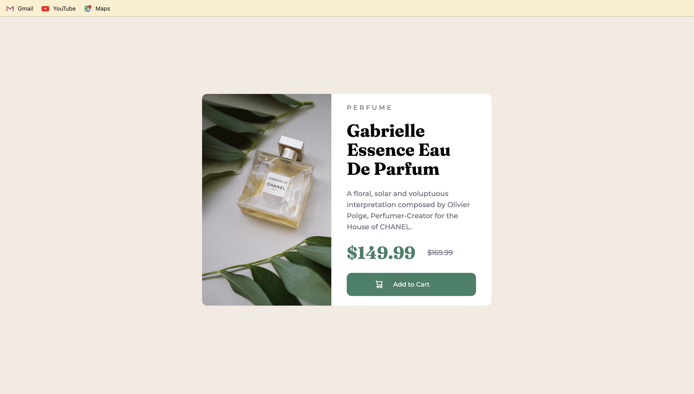

# Frontend Mentor 

A solution to the product preview challange by frontend mentor.

## Table of contents

- [Overview](#overview)
  - [Screenshot](#screenshot)
  - [Links](#links)
- [My process](#my-process)
  - [Built with](#built-with)
  - [Continued development](#continued-development)
  - [Useful resources](#useful-resources)
- [Author](#author)

## Overview

This project helped me understand the impportance of time management as i set a time limit to complete the challange. Its fascinating how simple challenges can teach you a lot about coding.

### Screenshot

### Links

- Solution URL: [Github URL](https://github.com/Kashyxp-patel/Product-preview-card-component)
- Live Site URL: [Live site URL](https://kashyxp-patel.github.io/Product-preview-card-component/)

### Continued development

In future want to add more animations to the images and texts and make it more responsive design...

### Useful resources

- [W3 Schools](https://www.w3schools.com/cssref/index.php)
- [MDN Web Docs](https://developer.mozilla.org/en-US/docs/Web/CSS)

## Author

- GitHub - [Github](https://github.com/Kashyxp-patel)
- Frontend Mentor - [Kashyxp-patel](https://www.frontendmentor.io/profile/Kashyxp-patel)
